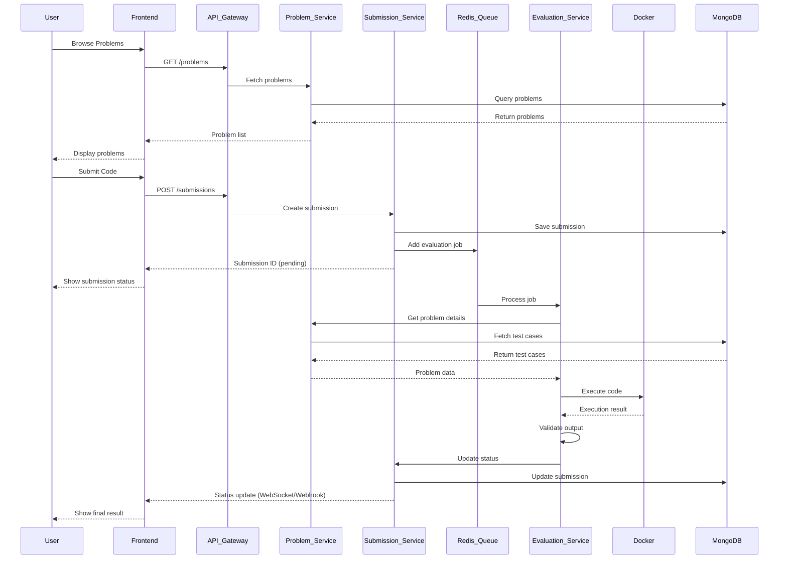

# LeetCode Backend - Microservices Architecture

A scalable, distributed backend system for a competitive programming platform built with Node.js, TypeScript, and microservices architecture. The system handles problem management, code submissions, and automated evaluation using Docker containers.

## 🏗️ System Architecture

### High-Level Design (HLD) Overview

The system follows a **microservices architecture** with three core services:

```
┌─────────────────┐    ┌─────────────────┐    ┌─────────────────┐
│   Frontend/UI   │    │   API Gateway   │    │   Load Balancer │
└─────────────────┘    └─────────────────┘    └─────────────────┘
                                │
                    ┌───────────┼───────────┐
                    │           │           │
            ┌───────▼──────┐ ┌──▼────┐ ┌────▼──────┐
            │ Problem      │ │       │ │ Submission│
            │ Service      │ │ Redis │ │ Service   │
            │ (Port 3000)  │ │       │ │ (Port 3001)│
            └──────────────┘ └───────┘ └───────────┘
                    │                     │
                    └──────────┬──────────┘
                               │
                    ┌──────────▼──────────┐
                    │ Evaluation Service  │
                    │ (Port 3003)         │
                    └─────────────────────┘
                               │
                    ┌──────────▼──────────┐
                    │ Docker Containers    │
                    │ (Code Execution)     │
                    └─────────────────────┘
```

### Core Services

#### 1. Problem Service (Port 3000)
- **Purpose**: Manages coding problems, test cases, and problem metadata
- **Database**: MongoDB
- **Key Features**: CRUD operations, search, filtering by difficulty

#### 2. Submission Service (Port 3001)
- **Purpose**: Handles code submissions, status tracking, and queue management
- **Database**: MongoDB + Redis (for job queue)
- **Key Features**: Multi-language support, asynchronous processing

#### 3. Evaluation Service (Port 3003)
- **Purpose**: Executes code in isolated Docker containers and evaluates results
- **Queue**: BullMQ with Redis
- **Key Features**: Sandboxed execution, timeout handling, result validation

## 🔄 Data Flow Diagram



## 📡 API Endpoints

### Problem Service (Base: `/api/v1/problems`)

| Method | Endpoint | Description |
|--------|----------|-------------|
| `POST` | `/` | Create a new problem |
| `GET` | `/` | Get all problems (with pagination) |
| `GET` | `/:id` | Get a specific problem by ID |
| `PUT` | `/:id` | Update a problem by ID |
| `DELETE` | `/:id` | Delete a problem by ID |
| `GET` | `/difficulty/:difficulty` | Get problems by difficulty (easy/medium/hard) |
| `GET` | `/search?q=query` | Search problems by title |

### Submission Service (Base: `/api/v1/submissions`)

| Method | Endpoint | Description |
|--------|----------|-------------|
| `POST` | `/` | Create a new submission |
| `GET` | `/:id` | Get submission by ID |
| `GET` | `/problem/:problemId` | Get submissions by problem ID |
| `DELETE` | `/:id` | Delete a submission |
| `PUT` | `/:id/status` | Update submission status |

### Evaluation Service (Base: `/api/v1`)

| Method | Endpoint | Description |
|--------|----------|-------------|
| `GET` | `/ping` | Service health check |

## 🛠️ Technology Stack

### Core Technologies
- **Runtime**: Node.js 18+ with TypeScript
- **Framework**: Express.js
- **Database**: MongoDB with Mongoose ODM
- **Queue**: BullMQ with Redis
- **Containerization**: Docker for code execution
- **Logging**: Winston with daily rotation

### Development Tools
- **Build Tool**: TypeScript Compiler
- **Development**: Nodemon + tsx
- **Validation**: Zod schemas
- **HTTP Client**: Axios
- **Docker Management**: Dockerode

### Supported Languages
- **Python**: Official Python Docker image
- **C++**: GCC-based Docker image
- **Java**: (Planned)
- **JavaScript**: (Planned)

## 🚀 Quick Start

### Prerequisites
- Node.js (v18 or higher)
- Docker and Docker Compose
- MongoDB
- Redis server
- Git

### Installation

1. **Clone the repository**
   ```bash
   git clone https://github.com/VivekKumarDwivedi/Leetcode-Node-Backend.git
   cd Leetcode-Node-Backend
   ```

2. **Install dependencies for all services**
   ```bash
   # Problem Service
   cd ProblemService
   npm install
   
   # Submission Service
   cd ../SubmissionService
   npm install
   
   # Evaluation Service
   cd ../EvaluationService
   npm install
   ```

3. **Environment Setup**
   
   Create `.env` files in each service directory:
   
   **Problem Service (.env)**
   ```env
   PORT=3000
   MONGODB_URI=mongodb://localhost:27017/problem-service
   ```
   
   **Submission Service (.env)**
   ```env
   PORT=3001
   MONGODB_URI=mongodb://localhost:27017/submission-service
   REDIS_URL=redis://localhost:6379
   ```
   
   **Evaluation Service (.env)**
   ```env
   PORT=3003
   PROBLEM_SERVICE=http://localhost:3000/api/v1
   SUBMISSION_SERVICE=http://localhost:3001/api/v1
   REDIS_HOST=localhost
   REDIS_PORT=6379
   ```

4. **Start all services**
   
   In separate terminals:
   ```bash
   # Terminal 1: Problem Service
   cd ProblemService
   npm run dev
   
   # Terminal 2: Submission Service
   cd SubmissionService
   npm run dev
   
   # Terminal 3: Evaluation Service
   cd EvaluationService
   npm run dev
   ```

## 📊 Submission Status Flow

```
PENDING → EVALUATING → COMPLETED
                    ↓
                ERROR/TLE/WA/AC
```

- **PENDING**: Submission queued for evaluation
- **EVALUATING**: Code is being executed
- **COMPLETED**: Evaluation finished
- **AC**: Accepted - All test cases passed
- **WA**: Wrong Answer - Output doesn't match
- **TLE**: Time Limit Exceeded
- **ERROR**: Runtime error during execution

## 🔧 Configuration

### Docker Images
The Evaluation Service automatically pulls required Docker images:
- Python runtime image
- C++ GCC runtime image

### Logging
All services use Winston for structured logging:
- Daily log rotation
- JSON format for easy parsing
- Request correlation IDs
- Multiple log levels (error, warn, info, debug)

### Security Features
- Sandboxed code execution in Docker containers
- Input validation using Zod schemas
- Request timeout handling
- Container isolation

## 📁 Project Structure

```
Leetcode-Node-Backend/
├── ProblemService/
│   ├── src/
│   │   ├── config/          # Database and logger config
│   │   ├── controllers/     # Request handlers
│   │   ├── dtos/           # Data transfer objects
│   │   ├── middlewares/     # Custom middleware
│   │   ├── models/         # MongoDB schemas
│   │   ├── repositories/   # Data access layer
│   │   ├── routers/        # API routes
│   │   ├── services/       # Business logic
│   │   ├── utils/          # Utility functions
│   │   └── validators/     # Input validation schemas
│   ├── package.json
│   └── README.md
├── SubmissionService/
│   ├── src/
│   │   ├── config/
│   │   ├── controllers/
│   │   ├── models/
│   │   ├── producers/      # Queue job creation
│   │   ├── queues/         # Job processing
│   │   ├── repositories/
│   │   ├── routers/
│   │   ├── services/
│   │   └── validators/
│   ├── package.json
│   └── README.md
├── EvaluationService/
│   ├── src/
│   │   ├── config/
│   │   ├── controllers/
│   │   ├── docker/         # Docker management
│   │   ├── models/
│   │   ├── queues/         # Job processing
│   │   ├── routers/
│   │   ├── services/
│   │   └── workers/        # Evaluation workers
│   ├── package.json
│   └── README.md
└── README.md               # This file
```

## 🔍 Monitoring & Observability

### Health Checks
Each service provides a health check endpoint:
- `GET /api/v1/ping` - Returns service status

### Logging Strategy
- **Structured Logging**: JSON format for easy parsing
- **Correlation IDs**: Track requests across services
- **Log Levels**: error, warn, info, debug
- **Rotation**: Daily rotation with 14-day retention

### Performance Metrics
- Request/response times
- Queue processing times
- Docker container execution times
- Database query performance

## 🚀 Deployment

### Development Environment
```bash
# Using Docker Compose (recommended)
docker-compose up -d
```

### Production Environment
1. Build all services:
   ```bash
   npm run build  # In each service directory
   ```

2. Use process manager (PM2):
   ```bash
   pm2 start ecosystem.config.js
   ```

3. Set up reverse proxy (Nginx)
4. Configure SSL certificates
5. Set up monitoring and alerting

## 🤝 Contributing

1. Fork the repository
2. Create a feature branch (`git checkout -b feature/amazing-feature`)
3. Commit your changes (`git commit -m 'Add amazing feature'`)
4. Push to the branch (`git push origin feature/amazing-feature`)
5. Open a Pull Request

### Development Guidelines
- Follow TypeScript best practices
- Write comprehensive tests
- Update documentation for API changes
- Use conventional commit messages
- Ensure all services pass linting and type checking

## 📄 License

This project is licensed under the ISC License - see the LICENSE file for details.

## 🆘 Troubleshooting

### Common Issues

1. **Docker Container Issues**
   - Ensure Docker is running
   - Check available disk space
   - Verify Docker images are pulled correctly

2. **Redis Connection Issues**
   - Verify Redis server is running
   - Check connection string in .env files
   - Ensure Redis is accessible from all services

3. **MongoDB Connection Issues**
   - Verify MongoDB is running
   - Check connection string format
   - Ensure database exists and is accessible

4. **Port Conflicts**
   - Default ports: 3000 (Problem), 3001 (Submission), 3003 (Evaluation)
   - Update PORT environment variables if needed

### Getting Help
- Check individual service README files for detailed troubleshooting
- Review logs in each service directory
- Ensure all environment variables are correctly set
- Verify all external dependencies (MongoDB, Redis, Docker) are running
